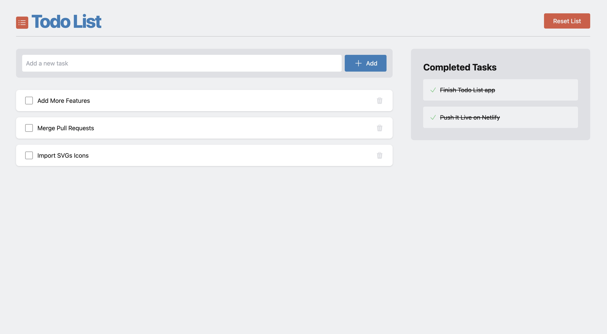

# Todo List

A simple Todo List created using React for study purposes.

This initial version uses React hooks and saves data to localStorage. The "[feat/using-signals](https://github.com/gustavocardoso/todo/tree/feat/using-signals)" branch version uses signals instead of hooks.

Live demo: [https://todo-app-now.netlify.app/](https://todo-app-now.netlify.app/)

